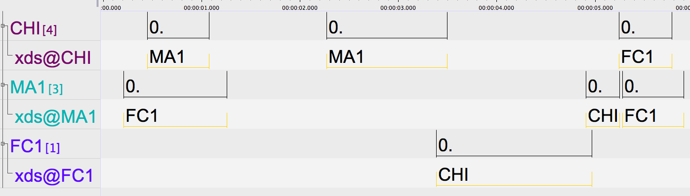

# chattr
R package (really just a set of .R scripts right now) for extracting turn-interactive measures from tabular conversation data.

Researchers who are interested in studying turn-taking behaviors in their naturalistic data are currently (primarily) limited to identifying those behaviors by either manually reviewing their data or, for some, by using the Conversational Turn Count and Conversational Block output from the LENA system. The former approach results in highly variable data across studies and the latter approach uses an unsatisfactory basis for interactional timing (allowing up to 5s of silence between turns).

### What does chattr do?

chattr is a package for identifying turn transitions (i.e., when one speaker stops and another starts) in annotated speech data. It can take annotations from LENA .its files, .txt files exported from ELAN, or from other sources (see below). To detect turn transitions, chattr scans a temporal window around each target child utterance (t<sub>0</sub>) for potential prompts (t<sub>-1</sub>) or responses (t<sub>+1</sub>) to that utterance. The user can either use the default temporal window (see Fig 1) or specify their own timing constraints for the allowed amount of overlap and gap at speaker transitions. If the annotated data contains information about addressee, users can also limit the search for contingent utterances to those directed to the target child.

Once chattr has scanned the file, it produces a table of all target child utterances with the onset, offset, and speaker information for detected prompts and responses; it also reports same-speaker utterance increments for each turn involved in the transition (see below). chattr can also take that table of detected turn transitions and use it to compute the number of interactional sequences present.

Because of the turn transition and interactional sequence output is informative about the temporal and speaker-specific characteristics of the turn-taking behavior, chattr data can be used to compute any number of interactional measures, including:

* Rate of turn-taking (i.e., rate of child--other and other--child transitions)
* Frequency and duration of interactional sequences
* Speed of turn transitions
* Hourly and daily trends in interactional bursts
* Ratio of vocalization by the child and others during turn exchanges
* Differences in turn-taking between the child and different family members

I'm sure you can think of many more ideas! We provide a few real examples below. (**not yet**)

### What is a turn transition?

Turn transitions are at the heart of the chattr package. To illustrate how transitions are detected, we here provide a brief example with multi-party interaction, annotated in ELAN. The interactants present are the target child (CHI), a male adult (MA1), and a female child (FC1). Each speaker also has an addressee tier where the intended addressee for each utterances is marked.

Example of a few seconds of multi-party interaction:


In this brief exchange, even without knowing anything further about timing, we would probably detect two turn transitions: one from CHI to MA1 and one from FC1 to CHI.

### What is an interactional sequence?


## How to use chattr
chattr is designed to be straightforward to use, even for those who are just starting out with R. It has three core functions, which feed into each other as 1 >> 2 >> 3:

1. `read_spchtbl()` converts your annotated speech file into a format chattr can process (speech table; _spchtbl_)
2. `fetch_transitions()` scans your _spchtbl_ for turn transitions between a focal speaker and their interactant(s) and gives you back a turn transition table (_tttbl_)
3. `fetch_intseqs()` scans your _tttbl_ for interactional sequences and gives you back an table of interactional sequences.

To do all this, chattr needs to know what type of file you would like it to read, who your focal speaker is, who their interactants are, and what kinds of timing restrictions to use when looking for contingent turns.

**NOTE:** The `fetch_transitions()` and `fetch_intseqs()` functions feature default temporal settings to encourage cross-study comparability in work using the chattr package. That said, these settings can be easily changed when desired. There are examples of default and non-default calls below.

### Step 1: Read in your data with read_spchtbl()

Input data for the core turn-measuring functions should take one of three forms:

#### Utterance timing and addressee information
Data of this type has four columns, with each row representing a single utterance. The column are speaker (who is producing the utterance?), start.ms (what is the start time of the utterance in msec?), stop.ms (what is the stop time of the utterance in msec?), and addressee (who is the speaker talking to?). Input files of this type should be read in with the argument `aas-elan-txt`. It is named after the ACLEW Annotation Scheme, an ELAN-based annotation approach for naturalistic speech recordings that features comprehensive self-teaching manuals and a gold-standard test for new annotators (see more at [https://osf.io/b2jep/wiki/home/](); Casillas et al., 2017).

| speaker | start.ms | stop.ms | addressee |
|---------|----------|---------|-----------|
| CHI     | 450      | 1080    | MA1       |
| CHI     | 2274     | 3500    | MA1       |
| CHI     | 5251     | 5789    | FC1       |
| MA1     | 210      | 1260    | FC1       |
| MA1     | 4910     | 5256    | CHI       |
| MA1     | 5288     | 5909    | FC1       |
| FC1     | 3393     | 4971    | CHI       |

#### Utterance timing information only
Data of this type is similar to the AAS data type above, but lacks addressee annotations.

| speaker | start.ms | stop.ms |
|---------|----------|---------|
| CHI     | 450      | 1080    |
| CHI     | 2274     | 3500    |
| CHI     | 5251     | 5789    |
| MA1     | 210      | 1260    |
| MA1     | 4910     | 5256    |
| MA1     | 5288     | 5909    |
| FC1     | 3393     | 4971    |

For these first two types, you can either export your ELAN annotations to a tab-delimited text file (make sure you use msec) **or**, if you don't use ELAN, you can pre-process your data through some other means so that it fulfills one of these two formats.

#### LENA .its file
The third and final input data type is a LENA .its file. These files are the output of the LENA software and can be read in directly by chattr.

Here are some examples of data being read in:

```
my.aas.elan.data <- read_spchtbl("my_aas_elan_spchdata.txt",
                                  type = "aas-elan-txt")
my.basic.data <- read_spchtbl("my_basic_spchdata.txt",
                               type = "elan-basic-txt")
my.lena.data <- read_spchtbl("my_its_file.its",
                              type = "lena-its")

# If you do not provide a file type, read_spchtbl() will give you an error:
my.lena.data <- read_spchtbl("my_its_file.its")
> Data not read: No file type provided

# If you provide the wrong file type, read_spchtbl() will try to
# give you an error:
my.lena.data <- read_spchtbl("my_its_file.its",
                              type = "aas-elan-txt")
> Data not read: Input does not match given input type
```

### Step 2: Detect transitions with fetch_transitions()
### Step 3: Detect interactional sequences with fetch_intseq()


## FAQs

### Is chattr only for child language data?
In principle, you can use chattr functions to detect temporal contingencies between any 2+ data streams that feature a binary state (i.e., "happening now" vs. "not happening now"), so long as you format the data as one of the readable inputs below. Some examples might include:

* Measuring the turn-transition rate between all speakers in a multi-party setting with addressee coding by running the transition detector once for each speaker with that person as 'focal' and the others as 'interactants'
* Detecting contingencies between vocalizations and ambient music
* Identifying turn-taking behavior in annotated data from non-human animals


## References
VanDam, M., Warlaumont, A. S., Bergelson, E., Cristia, A., Soderstrom,
M., Palma, P. D., & MacWhinney, B. (2016). HomeBank: An online
repository of daylong child-centered audio recordings. _Seminars in
Speech and Language, 37_(2), 128-142. <doi:10.1055/s-0036-1580745>

VanDam, Mark (2018). VanDam Public 5-minute HomeBank Corpus. <doi:10.21415/T5388S>
