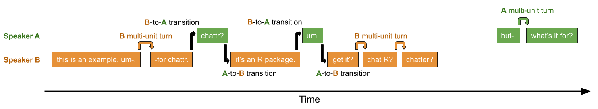

# chattr
chattr extracts turn-taking measures from tabular conversation data.

Researchers who are interested in studying turn-taking behaviors in their naturalistic data have traditionally been limited to either manually reviewing their data or, for LENA system users, using Conversational Turn Count and Conversational Block output. The former approach results in highly variable analyses across studies and the latter approach uses an unsatisfactory basis for interactional timing (e.g., allowing up to 5s of silence between turns, limited temporal reporting for closer analysis, proprietary software).

### What does chattr do?

chattr is a package for identifying turn transitions (i.e., when one speaker stops and another starts) in annotated speech data. It can take annotations from .its files exported from LENA, .txt files (e.g., exported from ELAN or other sources), or .rttm files (still under development; see Step 1 below). To detect turn transitions, chattr scans a temporal window around each target child utterance (t<sub>0</sub>) for potential prompts (t<sub>-1</sub>) and responses (t<sub>+1</sub>) to that utterance. The user can either employ the default temporal window (see Fig 1) or specify their own timing constraints for the allowed amount of overlap and gap at speaker transitions. For better cross-study comparability, we highly recommend using the default window (see the section on timing defaults below). If the annotated data contains information about addressee (i.e., to whom a vocalization is directed), users can also limit their search to just those utterances with the right 'addressee' value (e.g., child-directed speech).

Once chattr has scanned a file, it produces a table of all target child utterances, including the onset, offset, and speaker information for any detected prompts and responses; it also reports timing information for each increment of a multi-increment utterance (see Step 2 below). The table of detected turn transitions from Step 2 can also be given back to chattr in order to compute the number of interactional sequences present in the file (see Step 3 below).

Because the turn transition and interactional sequence output tables are informative about the temporal and speaker-specific characteristics of the turn-taking behaviors, chattr data can be used to compute any number of interactional measures. Here are a few ideas:

* Rate of turn-taking (i.e., rate of child--other and other--child transitions)
* Frequency and duration of interactional sequences
* Speed of turn transitions
* Hourly and daily trends in interactional bursts
* Ratio of vocalization by the child and others during turn exchanges
* Differences in turn-taking between the child and different family members

A few examples are provided in the subsection below called "How to use chatter".

### What is a turn transition?

Turn transitions are at the heart of the chattr package. A turn transition occurs when one speaker's turn stops and another speaker's turn begins. Every turn transition has a pre-transition speaker and a post-transition speaker—these must be different speakers.

* The turn transition _begins_ when the first turn ends.
* The turn transition _ends_ when the second turn starts.

If the second turn starts before the first turn ends, the transition time is negative; this is referred to as an instance of 'transitional overlap'. If the second turn starts after the first turn ends, the transition time is positive; referred to as an instance of 'transitional gap'. Sometimes speakers produce several chunks of speech before or after the transition (e.g., a sequence of related utterances forming one larger turn at talk). We refer to these sequences by the same speaker as 'multi-unit' turns. (see Fig 1 for examples). Speaker and timing information for every turn unit involved in a turn transition are given in the chattr output.

### What is an interactional sequence?

Interactional sequences, as defined in chatter, are unbroken sequences of turn taking between the target child and one or more interlocutors. They are akin to conversational bouts and may thereby reflect more structurally complex, engaged interactional behaviors than single turn transitions do.

As with turn transitions, interactional sequences in chattr can include multi-unit turns; transitions between speakers in an interactional sequence may be separated by multiple turn units from each speaker.

Below we show an example of a few seconds of dyadic interaction between two speakers: A (green) and B (orange). In this example, the speakers use both single- and multi-unit turns. There are 6 turns at talk (3 from each speaker), 4 turn transitions (two each from B to A and vice versa), and one interactional sequence (the contiguous block of speaker continuation/transition; the other speech has no transitions and so is not an interactional sequence):




#### An important caveat

Any analyst looking manually at interactional data would always first check that the speakers are indeed mutually engaged before labeling and/or measuring an observed interactional phenomenon for further analysis (e.g., child-to-other turn transition). Unfortunately, this rich criterion for _semantic_ contingency between turns—not just _temporal_ contingency—is beyond what chattr can do. Consider, for example, a case where four co-present speakers engage in two simultaneous conversations. Because chattr only looks for temporal contingencies, it may detect transitions across conversations, and at the expense of catching within-conversation transitions. 

It is important to remember chattr only detects temporal patterns that look like turn-taking behavior. You as the analyst are responsible for checking how reliably the detected turn-taking behavior signals true conversational interaction. To overcome this limitation, consider adding addressee coding when your data features simultaneous interactions and/or highly variable interactional contexts.


## How to use chattr
chattr is designed to be straightforward to use, even for those who are just starting out with R. It has three core functions, which feed into each other as 1 >> 2 >> 3:

1. `read_spchtbl()` converts your annotated speech file into a format chattr can process (speech table; _spchtbl_)
2. `fetch_transitions()` scans your _spchtbl_ for turn transitions between a focal speaker and their interactant(s) and gives you back a turn transition table (_tttbl_)
3. `fetch_intseqs()` scans your _tttbl_ for interactional sequences and gives you back the transition table, only now including information about interactional sequences in the data.

To do all this, chattr needs to know what type of file you would like it to read, who your focal speaker is, who their interactants are, and what kinds of timing restrictions to use when looking for contingent turns.

**NOTE:** The `fetch_transitions()` function features multiple default settings to encourage cross-study comparability. These settings can be easily changed when needed (see Step 2 below).

### Step 1: Read in your data with read_spchtbl()

When reading in your data, you will need to specify which file you want to read and what type it is. You can also specify where to get information about regions of the audio that are annotated. For `read_spchtbl()`, you can provide the following arguments:

`type` = the type of input file you want to read in.

`cliptier` = the name of the tier on which information about annotated regions can be found. This information should be listed as if the clip tier is another speaker (see below). By default chattr assumes that you don't have a clip tier and will therefore scan the whole file when you search for turn transitions and interactional sequences.

#### File type

You must specify what type of input data you have. Input data for chattr can take one of three forms:

_1. Utterance timing and addressee information_

Data of this type has four columns, with each row representing a single utterance. The columns are `speaker` (who is producing the utterance?), `start.ms` (what is the start time of the utterance in msec?), `stop.ms` (what is the stop time of the utterance in msec?), and `addressee` (who is the speaker talking to?). Input files of this type should be read in with the argument `aas-elan-txt`. This input type is named after the ACLEW Annotation Scheme, an ELAN-based annotation approach for naturalistic speech recordings that features comprehensive self-teaching manuals and a gold-standard test for new annotators (see more at [https://osf.io/b2jep/wiki/home/](), Casillas et al., 2017; ELAN: [https://tla.mpi.nl/tools/tla-tools/elan/download/](), Sloetjes & Wittenburg, 2008).

| speaker | start.ms | stop.ms | addressee |
|---------|----------|---------|-----------|
| CHI     | 450      | 1080    | MA1       |
| CHI     | 2274     | 3500    | MA1       |
| CHI     | 5251     | 5789    | FC1       |
| MA1     | 210      | 1260    | FC1       |
| MA1     | 4910     | 5256    | CHI       |
| MA1     | 5288     | 5909    | FC1       |
| FC1     | 3393     | 4971    | CHI       |

_2. Utterance timing information only_

Data of this second type is identical to the AAS type above, but lacks addressee annotations. Input files of this type should be read in with the argument `elan-basic-txt`.

| speaker | start.ms | stop.ms |
|---------|----------|---------|
| CHI     | 450      | 1080    |
| CHI     | 2274     | 3500    |
| CHI     | 5251     | 5789    |
| MA1     | 210      | 1260    |
| MA1     | 4910     | 5256    |
| MA1     | 5288     | 5909    |
| FC1     | 3393     | 4971    |

For these first two types, you can either export ELAN annotations to a tab-delimited text file (make sure you use msec; guide [here](https://docs.google.com/presentation/d/1HepQNaqjWaL0l_L7CN38fGGBoYAuGOS6jPKaLLrRJsw/edit?usp=sharing)) or, if you don't use ELAN, you can independently pre-process your data so that it follows one of these two formats.

_3. LENA .its file_

The third and final input data type is a LENA .its file. These files are the output of the LENA system software and can be read in directly by chattr.

#### Cliptier (optional argument)
The user can also specify a `cliptier` used in the annotation data. Many recordings, particularly long-format ones, are only partially annotated. If the data includes onset and offset times for the annotated regions of the recording, this information can be used to more efficiently process the data and to enable the analyst to compute by-region statistics after using chattr. By default, read_spchtbl() assumes no clip tier and will scan the entire file.

| speaker  | start.ms | stop.ms | addressee |
|----------|----------|---------|-----------|
| CHI      | 450      | 1080    | MA1       |
| CHI      | 2274     | 3500    | MA1       |
| CHI      | 5251     | 5789    | FC1       |
| MA1      | 210      | 1260    | FC1       |
| MA1      | 4910     | 5256    | CHI       |
| MA1      | 5288     | 5909    | FC1       |
| FC1      | 3393     | 4971    | CHI       |
| clip_num | 0        | 10000   | clip1     |
| clip_num | 20000    | 30000   | clip2     |

Clip tiers should be formatted as another type of speaker, indicating the start, stop, and name of each annotated region in the `start.ms`, `stop.ms`, and `addressee` tiers as shown above. In this example, any speech between seconds 10 and 20 in the file will be ignored when searching for transitions and interactional sequences later on, and any turn transitions found will be labeled with respect to the annotated region in which they were found.

Here are some examples of data being read in:

```
# Examples without cliptier specifications
my.aas.elan.data <- read_spchtbl(filepath = "my_aas_elan_spchdata.txt",
                                  type = "aas-elan-txt")
my.basic.data <- read_spchtbl(filepath = "my_basic_spchdata.txt",
                               type = "elan-basic-txt")
my.lena.data <- read_spchtbl(filepath = "my_its_file.its",
                              type = "lena-its")

# Examples with cliptier specifications
my.aas.elan.data <- read_spchtbl(filepath = "my_aas_elan_spchdata.txt",
                                  type = "aas-elan-txt", cliptier = "clip_num")
my.basic.data <- read_spchtbl(filepath = "my_basic_spchdata.txt",
                               type = "elan-basic-txt", cliptier = "Task")

```

### Step 2: Detect transitions with fetch_transitions()

The turn transition detector is the most complex call in chattr. To scan for potential turn transitions, chattr needs to know a few things about your data and how you want it to be analyzed, including who your focal speaker is (e.g., the target child), which interactant(s) you want it to consider, whether you have addressee tags, and how it should decide between multiple possible transition points.

When you call `fetch_transitions()`, you can provide the following arguments:

`spchtbl` = a speech table you created by reading a file in with read_spchtbl().

`allowed.gap` = the maximum amount of time, in milliseconds, that is allowed to pass during a speaker transition. Set to **XXXX** by default.

`allowed.overlap` = the maximum amount of time, in milliseconds, during which overlap is allowed allowed to occur at the turn transition. Set to **XXXX** by default.

`focus.child` = the name of your focal speaker (should be a value from the `speaker` column of your speech table.

`interactants` = the name of all speakers who can be considered as interactants with the focal speaker. This can be a single string (e.g., "Adult1") or a list of strings (e.g., "c("Adult1", "Adult2", "Child2")"). Set to **".all-speakers"** by default, which can be used to search for transitions between the focal speaker and all other speakers present in the speech table.

`addressee.tags` = the type of addressee tag system present in the data. Current options are "CDS" or "TCDS", both based on the ACLEW Annotation Scheme ([https://osf.io/b2jep/wiki/home/]()). Set to **"none"** by default.

`mode` = the strategy to use when deciding between multiple candidate prompts or responses to a given focal speaker utterance. Current options are "strict", "stretch", "qulr" (quick-uptake, late-response), and "luqr" (late-uptake, quick-response). Strict picks candidates that minimize the duration of the turn transition. Stretch picks candidates that maximize it. The other two modes mix these options: qulr picks prompts that minimize transition duration but responses that maximize it, and luqr vice versa. Set to **"strict"** by default.
 
**SORRY THESE DEFAULTS ARE NOT ACTUALLY SET UP YET!!**

The only two arguments that _need_ to be provided (i.e., that do not have default settings) are `spchtbl` (what data do you want to analyze?) and `focus.child` (who is the focal speaker?); the rest can be changed at the analyst's discretion.

Here are some examples of data being scanned for turn transitions:

```
# Example call on with all defaults
my.aas.elan.data.tttbl <- fetch_transitions(
  spchtbl = my.aas.elan.data,
  focus.child = "CHI")

# Example call changing the defaults
my.basic.data.tttbl <- fetch_transitions(
  spchtbl = my.basic.data,
  allowed.gap = 5000, allowed.overlap = 5000,
  focus.child = "Sammy", interactants = c("Father", "Grandmother"),
  addressee.tags = "TCDS", mode = "stretch")

# Example LENA call, with some changed defaults
near.adult.tiers <- unique(my.lena.data$speaker)[grep(
  "[MF]AN", unique(my.lena.data$speaker))]
my.lena.data.tttbl <- fetch_transitions(
  spchtbl = my.lena.data,
  focus.child = "CHN", interactants = near.adult.tiers)
# Note that each full-day LENA file can take 5–20 seconds to process

```

### Step 3: Detect interactional sequences with fetch_intseqs()

The interactional sequence detector only takes one argument: a turn transition table created with `fetch_transitions()`. It groups together the utterances associated with transitions that have at least one turn in common or that overlap in time.

Here are some examples of transitions being scanned for interactional sequences:

```
my.aas.elan.data.intseqs <- fetch_intseqs(my.aas.elan.data.tttbl)
my.basic.data.intseqs <- fetch_intseqs(my.basic.data.tttbl)
my.lena.data.intseqs <- fetch_intseqs(my.lena.data.tttbl)
```

### Putting it all together

Because chattr cals on the tidyverse package ([https://www.tidyverse.org/](); Wickham et al., 2019), these calls can be tidily combined as follows:

```
# Example with default settings
my.aas.elan.data.intseqs <- read_spchtbl(
    filepath = "my_aas_elan_spchdata.txt",
    tbltype = "aas-elan-txt", cliptier = "clip") %>%
  fetch_transitions(focus.child = "CHI") %>%
  fetch_intseqs()

# Example with non-default settings
my.basic.data.intseqs <- read_spchtbl(
    filepath = "my_basic_spchdata.txt",
    tbltype = "elan-basic-txt", cliptier = "Task") %>%
  fetch_transitions(allowed.gap = 5000, allowed.overlap = 5000,
  focus.child = "Sammy", interactants = c("Father", "Grandmother"),
  addressee.tags = "TCDS", mode = "stretch") %>%
  fetch_intseqs()
```

## How to understand the results

Once you run `fetch_transitions()` over your data, you will get a detailed table back describing the detected transition information, with one row for each focal speaker utterance:

### About the focal speaker utterance

`speaker` = the name of the speaker analyzed as the 'focal' speaker.

`annot.clip` = the label for the annotation clip in which the focal speaker utterance was made.

`start.ms` = the start time of the focal speaker utterance in msec from the beginning of the file.

`stop.ms` = the stop time of the focal speaker utterance in msec from the beginning of the file.

`spkr.prev.increment.start` = the start time of the earliest same-speaker increment before the focal speaker utterance, in msec from the beginning of the file. If no same-speaker pre-utterance increments were found, NA.

`spkr.prev.increment.stop` = the stop time of the earliest same-speaker increment before the focal speaker utterance, in msec from the beginning of the file. If no same-speaker pre-utterance increments were found, NA.

`spkr.post.increment.start` = the start time of the latest same-speaker increment after the focal speaker utterance, in msec from the beginning of the file. If no same-speaker post-utterance increments were found, NA.

`spkr.post.increment.stop` = the stop time of the latest same-speaker increment after the focal speaker utterance, in msec from the beginning of the file. If no same-speaker post-utterance increments were found, NA.

`addressee` = the addressee value for the focal speaker utterance. If there is no addressee value, NA.

### About the prompt found, if any

`prompt.spkr` = assuming a "prompt" (i.e., a turn after which there is a transition to the focal speaker), the name of the speaker who provided the prompt. If no prompt was found, NA.

`prompt.start.ms` = assuming a prompt, the start time of the prompt utterance in msec from the beginning of the file. If no prompt was found, NA.

`prompt.stop.ms` = assuming a prompt, the stop time of the prompt utterance in msec from the beginning of the file. If no prompt was found, NA.              

`prompt.prev.increment.start` = assuming a prompt, the start time of the earliest same-speaker increment before the prompt utterance, in msec from the beginning of the file. If no prompt was found or no same-speaker pre-prompt increments were found, NA.

`prompt.prev.increment.stop` = assuming a prompt, the stop time of the earliest same-speaker increment before the prompt utterance, in msec from the beginning of the file. If no prompt was found or no same-speaker pre-prompt increments were found, NA. 

### About the response found, if any

`response.spkr` = assuming a "response" (i.e., a turn that is preceded by a transition from the focal speaker), the name of the speaker who provided the response. If no response was found, NA.

`response.start.ms` = assuming a response, the start time of the response utterance in msec from the beginning of the file. If no response was found, NA.           

`response.stop.ms` = assuming a response, the stop time of the response utterance in msec from the beginning of the file. If no response was found, NA.           

`response.post.increment.start` = assuming a response, the start time of the latest same-speaker increment after the response utterance, in msec from the beginning of the file. If no response was found or no same-speaker post-response increments were found, NA.

`response.post.increment.stop` = assuming a response, the stop time of the latest same-speaker increment after the response utterance, in msec from the beginning of the file. If no response was found or no same-speaker post-response increments were found, NA.

### About the interactional sequences

If you additionally run `fetch_intseqs()` the following five columns will be added to the transition table:

`seq.num` = the interactional sequence number in which the turn can be found. The number increments from 1, starting with the first sequence detected. If the utterance/turn transition is not part of an interactional sequence, NA.
                      
`seq.start.ms` = the start time of the interactional sequence in msec from the beginning of the file. If the utterance/turn transition is not part of an interactional sequence, NA.

`seq.stop.ms` = the stop time of the interactional sequence in msec from the beginning of the file. If the utterance/turn transition is not part of an interactional sequence, NA.

`seq.start.spkr` = the speaker who produced the first utterance in the interactional sequence (i.e., beginning at `seq.start.ms`). If the utterance/turn transition is not part of an interactional sequence, NA.

`seq.stop.spkr` = the speaker who produced the last utterance in the interactional sequence (i.e., ending at `seq.stop.ms`). If the utterance/turn transition is not part of an interactional sequence, NA.

### Example output file use cases

This detailed information about the start times, stop times, and speakers involved in both turn transitions and interactional sequences for each focal speaker utterance can be used to develop a large number of analyses. We here provide two examples below:

```
# Variation in turn transition rate across clips
my.aas.elan.data.intseqs.summary <- read_spchtbl(
    filepath = "my_aas_elan_spchdata.txt",
    tbltype = "aas-elan-txt", cliptier = "clip") %>%
  fetch_transitions(focus.child = "CHI") %>%
  fetch_intseqs() %>%
  mutate(
    n.transitions = case_when(
      !is.na(prompt.spkr) & !is.na(response.spkr) ~ 2,
      !is.na(prompt.spkr) | !is.na(response.spkr) ~ 1,
      TRUE ~ 0
    )) %>%
  group_by(annot.clip) %>%
  summarize(total.transitions =  sum(n.transitions))  
```

The code above gives a table like the following for further analysis:

| annot.clip | total.transitions |
|------------|-------------------|
| clip1      | 18                |
| clip2      | 52                |
| clip3      | 3                 |
| clip4      | 7                 |
| clip5      | 38                |
| ...        | ...               |


Another example:

```
# Descriptive characteristics of interactional sequences
# with male and female adults in a LENA file
near.adult.tiers <- c("MAN", "FAN")
my.lena.data.intseqs.summary <- read_spchtbl(
  paste0(input.data.path, its.files[1]), "lena-its") %>%
  fetch_transitions(allowed.gap, allowed.overlap,
    "CHN", near.adult.tiers, "none", "strict") %>%
  fetch_intseqs() %>%
  mutate(
    seq.start.sec = round(seq.start.ms/1000,2),
    seq.dur.sec = round((seq.stop.ms - seq.start.ms)/1000,3),
    chi.initiated = ifelse(seq.start.spkr == "CHN", 1, 0),
    n.transitions = case_when(
      !is.na(prompt.spkr) & !is.na(response.spkr) ~ 2,
      !is.na(prompt.spkr) | !is.na(response.spkr) ~ 1,
      TRUE ~ 0
  )) %>%
  group_by(seq.num, seq.start.sec, seq.dur.sec, chi.initiated) %>%
  summarize(seq.tot.trnstns = sum(n.transitions))
```

The code above gives a table something like the following for further analysis:

| seq.num  | seq.start.sec | seq.dur.sec | chi.initiated | seq.tot.trnstns |
|----------|---------------|-------------|---------------|-----------------|
| 1        | 0.00          | 2.07        | 1             | 2               |
| 2        | 121.83        | 3.81        | 1             | 2               |
| 3        | 177.86        | 1.60        | 1             | 1               |
| 4        | 460.78        | 9.69        | 0             | 3               |
| 5        | 535.49        | 3.90        | 1             | 2               |
| 6        | 571.22        | 3.26        | 0             | 1               |
| ...      | ...           | ...         | ...           | ...             |

## Final comments

### chattr isn't limited to child language data... or even to speech data!
In principle, you can use chattr functions to detect temporal contingencies between any 2+ data streams that feature a binary state (i.e., "happening now" vs. "not happening now"), so long as you format the data as one of the readable inputs below. Some examples might include:

* Measuring the turn-transition rate between all speakers in a multi-party setting with addressee coding by running the transition detector once for each speaker with that person as 'focal' and the others as 'interactants'
* Detecting contingencies between vocalizations and ambient music
* Identifying turn-taking behavior in annotated data from non-human animals

### If you use chattr, please cite it
The following reference is the most current one for use in your academic output involving the chattr package: Casillas, M. (in preparation). The chattr package.

### Find a problem? Have a feature request? Please let us know!
Please submit your issue with a detailed description and, if you have found a bug, a way to replicate it to our github page: [https://github.com/marisacasillas/chattr-basic]()


## References
VanDam, M., Warlaumont, A. S., Bergelson, E., Cristia, A., Soderstrom,
M., Palma, P. D., & MacWhinney, B. (2016). HomeBank: An online
repository of daylong child-centered audio recordings. _Seminars in
Speech and Language, 37_(2), 128-142. <doi:10.1055/s-0036-1580745>

VanDam, Mark (2018). VanDam Public 5-minute HomeBank Corpus. <doi:10.21415/T5388S>
